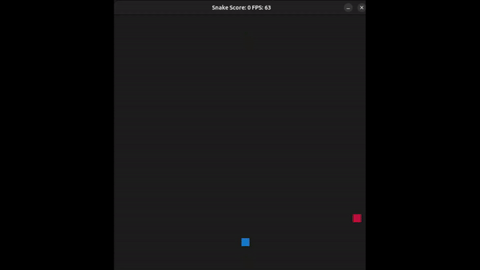

# Capstone Snake Game new version

This is a new version of the Snake Game, which has been developed to fulfill the [Udacity C++ Nanodegree Program](https://www.udacity.com/course/c-plus-plus-nanodegree--nd213) 
The code for this repo was inspired by [this](https://codereview.stackexchange.com/questions/212296/snake-game-in-c-with-sdl) excellent StackOverflow post and set of responses.

## New Features
* If the score of the player is on the Top 3, then he can summit its name and save its score.
* There are different types of food:
  * Normal food (1 point)
  * Golden food (2 points)
  * Slow food (decreasses snake's speed) 
* Concurrency has been added to render the body of the snake.

## Rubric points addressed
* Loops, Functions, I/O
  * The project reads data from a file and process the data, or the program writes data to a file.
    * scores.cpp/getScores() line 9 - game reads from a file
    * scores.cpp/setScores() line 40 - game writes in a file
  * The project accepts user input and processes the input.
    * controller.cpp/HandleInput() and PauseGame() line 38 & 46 - the user can pause the game (Space)
    * main.cpp line 27 - user can save his score
* Object Oriented Programming
  * One or more classes are added to the project with appropriate access specifiers for class members.
    * Food and Scores classe added in food.h and scorers.h
  * Class constructors utilize member initialization lists.
    * In scores.h and food.h the constructore uses initilization list to define different private variables.
  * Classes abstract implementation details from their interfaces.
    * In classes food and scores the methods have been defined so they stick to the abtraction of the classes.
* Memory Management
  * The project makes use of references in function declarations.
    * In food.h, in getPosition() line 27, setPosition() line 28, setColor() line 30.
  * The project uses move semantics to move data instead of copying it, where possible.
    * In renderer.cpp/Render() line 85, the snake is been used then moved back to the game.run().
  * The project uses smart pointers instead of raw pointers.
    * Line 10 in main a smart pointer is used.
    * In Render.h, RenderFood and RenderSnake has been overloaded to return and accept a shared pointer.
* Concurrency
  * The project uses multithreading.
    * In method RenderSnake() line 158 in renderer.cpp, concurrency is implemented to render the body of the snake in parallel.
  * A mutex or lock is used in the project.
    * In render.h a std::mutex has been added to ensure that not more than one thread access the function ´SDL_RenderFillRect´ (line 206, renderer.cpp).

## Dependencies for Running Locally
* cmake >= 3.7
  * All OSes: [click here for installation instructions](https://cmake.org/install/)
* make >= 4.1 (Linux, Mac), 3.81 (Windows)
  * Linux: make is installed by default on most Linux distros
  * Mac: [install Xcode command line tools to get make](https://developer.apple.com/xcode/features/)
  * Windows: [Click here for installation instructions](http://gnuwin32.sourceforge.net/packages/make.htm)
* SDL2 >= 2.0
  * All installation instructions can be found [here](https://wiki.libsdl.org/Installation)
  >Note that for Linux, an `apt` or `apt-get` installation is preferred to building from source. 
* gcc/g++ >= 5.4
  * Linux: gcc / g++ is installed by default on most Linux distros
  * Mac: same deal as make - [install Xcode command line tools](https://developer.apple.com/xcode/features/)
  * Windows: recommend using [MinGW](http://www.mingw.org/)

## Basic Build Instructions

1. Clone this repo.
2. Make a build directory in the top level directory: `mkdir build && cd build`
3. Compile: `cmake .. && make`
4. Run it: `./SnakeGame`.

## CC Attribution-ShareAlike 4.0 International

Shield: [![CC BY-SA 4.0][cc-by-sa-shield]][cc-by-sa]

This work is licensed under a
[Creative Commons Attribution-ShareAlike 4.0 International License][cc-by-sa].

[![CC BY-SA 4.0][cc-by-sa-image]][cc-by-sa]

[cc-by-sa]: http://creativecommons.org/licenses/by-sa/4.0/
[cc-by-sa-image]: https://licensebuttons.net/l/by-sa/4.0/88x31.png
[cc-by-sa-shield]: https://img.shields.io/badge/License-CC%20BY--SA%204.0-lightgrey.svg
